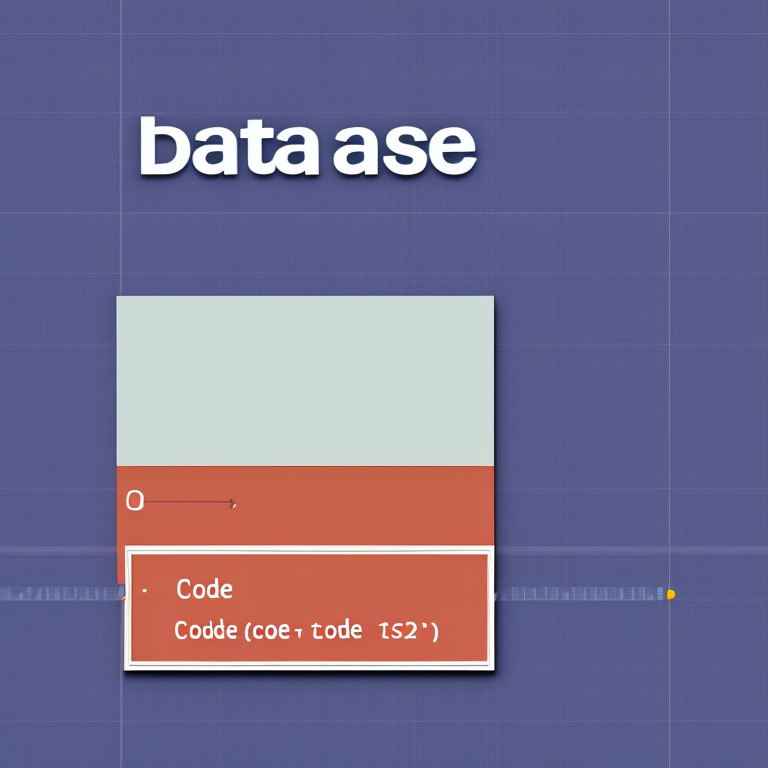
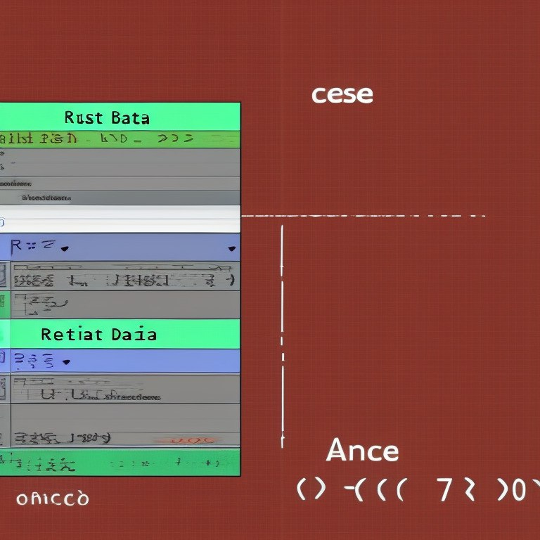
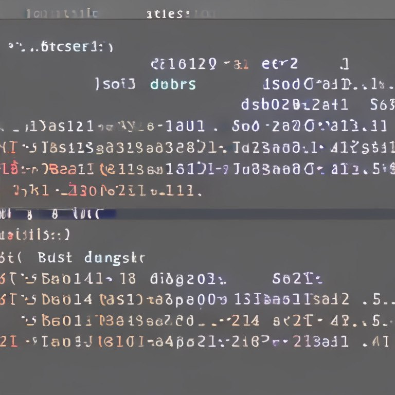

This file aims to describe how CraftFlow works and how it is structured in detail, to assist newcomers in understanding it and help them start contributing faster.

# How does CraftFlow work?

Please consult the following graphs:

  
<h3>High-level overview</h3>

 

  
<h3>Module structure</h3>

 

  
<h3>Data flow diagram</h3>

 

